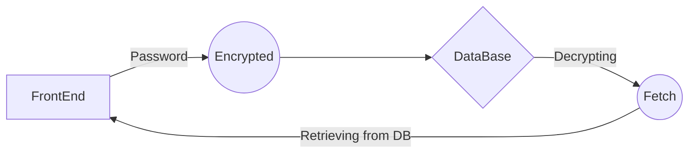

## Pass Vault

A Full Stack Applciation that stores all your password in the database.
The password are encyrpted by **AES-CTR encryption**.

> **AES-CTR**: An IV-based encryption scheme, the mode achieves indistinguishability from random bits assuming a nonce IV. As a
> **secure** nonce-based scheme, the mode can also be used as a probabilistic encryption scheme, with a random IV. Complete failure of privacy if a nonce gets reused on encryption or decryption.

This is the **backend/server side** of the application.
All the express Routes are established in here.
Connection with the DB is done here.

WorkFlow Diagram -->

